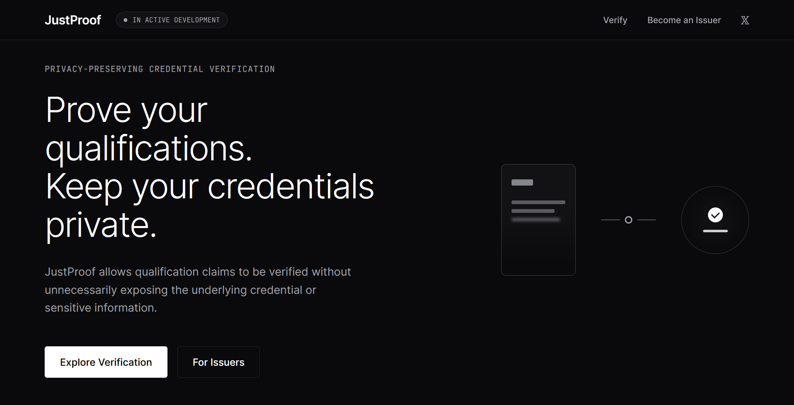

# JustProof

<div>

[](https://midnight.network/)
[](https://github.com/oluwatobiss/just-proof/actions/workflows/ci.yaml)

</div>

> **Prove your qualification. Keep your certificate private.**

JustProof is a privacy-preserving qualification verification application built on Midnight.



## Live Demo

- [Try JustProof](https://justproof.netlify.app)
- [Watch the DApp's Demo on YouTube](https://youtu.be/IE5ZEklu-24)

> **Development status:** JustProof is currently under active development. The V1 protocol and privacy architecture have been defined, and the smart-contract and end-to-end application flows are being implemented. The live deployment currently demonstrates the project's development progress.

## Contract Address

### Preview Network

| Network | Contract Address                                                   |
| ------- | ------------------------------------------------------------------ |
| Preview | `c68f314ffcf61644323c13ec6fa420a10b81bc45f569137bfa775bfd73bf8153` |

The application currently uses the Midnight Preview network.

## How it works

**Issuer → Holder → Verifier**

1. **Issuer** — Creates and signs a credential and registers its cryptographic commitment.
2. **Holder** — Keeps the credential and sensitive information privately.
3. **Verifier** — Requests a qualification proof and verifies the resulting zero-knowledge proof.

Midnight provides the privacy-preserving infrastructure that allows the proof to be generated and verified without exposing the underlying credential data.

## What This Product Does

Qualifications are often verified by asking people to share their certificates directly. That can expose considerably more information than a verifier actually needs, including personal details, credential identifiers, grades, signatures, and other certificate metadata. JustProof is designed to let people prove the qualification that matters without handing over the underlying certificate.

Credential holders use JustProof to generate privacy-preserving proofs for verifiers such as employers, organizations, course providers, and event organizers. Issuers provide credentials that can later be proven through the protocol, while verifiers receive cryptographic evidence that the requested qualification is valid rather than receiving the holder's complete credential.

JustProof uses Midnight because qualification verification is a natural selective-disclosure problem. Midnight's zero-knowledge capabilities make it possible to combine public protocol state—such as credential, issuer, and revocation commitments—with private holder data so that a verifier can validate a claim without requiring the private credential itself to become public.

## Privacy Model

JustProof separates the public information required for protocol verification from the private information required to construct a proof.

* **PUBLIC — on-chain, anyone can see:** protocol state required to establish recognized issuers, credential registration, and revocation state, represented through cryptographic commitments and roots rather than publication of the underlying private credential.
* **PRIVATE — private witness, never on-chain:** the holder's underlying credential data and private values used to demonstrate possession of and claims about that credential.
* **PROVED WITHOUT REVEALING:** that the holder possesses a credential satisfying the requested qualification requirements, that it is associated with a recognized issuer and registered credential state, and that it has not been revoked—without revealing the underlying certificate or unrelated private credential fields.

The protocol follows a minimal-disclosure principle: **prove the fact a verifier needs, not the document containing it.**

## Tech Stack

* **Smart Contracts:** Compact `0.23`, Midnight's domain-specific language for privacy-preserving smart contracts and zero-knowledge logic.
* **Blockchain:** Midnight Network.
* **Frontend:** React and TypeScript.
* **Backend Infrastructure:** Node.js and Express.js for issuer workflows, API routing, and required off-chain infrastructure.
* **Testing:** Vitest and TypeScript-based contract/integration tests.
* **Deployment:** Netlify for the web application.
* **Development Environment:** Midnight Compact toolchain and proof infrastructure.

The architecture intentionally favors a small, maintainable stack and avoids unnecessary framework or dependency complexity.

## Prerequisites

To develop and test the project locally, install:

- **Node.js:** `24.11.1` or higher
- **Docker**
- **Docker Compose**
- A supported Midnight wallet, like 1AM, for creator/network testing

## Local Development

### 1. Clone the Repository

```bash
git clone https://github.com/oluwatobiss/just-proof.git
cd just-proof
```

### 2. Install Dependencies

```bash
npm install
```

### 3. Compile the Compact Contract

```bash
npm run compile
```

This generates the JavaScript, cryptographic, and circuit artifacts required by the application and tests.

## Running the Application

Start the development server using the project's development script:

```bash
npm run dev
```

The application can then be opened in the browser at the local development URL reported by Vite.

## Testing

The project contains tests for both the local development environment and live Midnight networks.

### Local Tests

Start the local Midnight environment:

```bash
npm run env:up
```

Run the local tests:

```bash
npm run test:local
```

When finished:

```bash
npm run env:down
```

### Validate Everything Automatically

The project also provides:

```bash
npm run validate
```

This runs the local validation workflow, including starting the required environment, executing the tests, and shutting the environment down afterward.

## Preview Network Testing

Preview-network testing uses a wallet configured through environment variables.

### 1. Create the Environment File

```bash
cp .env.preview.example .env.preview
```

### 2. Configure the Wallet

Add either:

```text
MIDNIGHT_PREVIEW_MNEMONIC
```

or:

```text
MIDNIGHT_PREVIEW_SEED
```

to `.env.preview`.

The wallet must have the required Preview testnet funds and DUST delegation.

### 3. Run the Tests

```bash
npm run test:preview
```

The Preview test workflow deploys the contract and runs the integration tests against the live network.

> **Security:** Never commit `.env.preview`, `.env.preprod`, mnemonics, seeds, private keys, or other wallet credentials to Git.

## Preprod Network Testing

### 1. Create the Environment File

```bash
cp .env.preprod.example .env.preprod
```

### 2. Configure the Wallet

Add either:

```text
MIDNIGHT_PREPROD_MNEMONIC
```

or:

```text
MIDNIGHT_PREPROD_SEED
```

to `.env.preprod`.

The wallet must have the required Preprod testnet funds and DUST delegation.

### 3. Run the Tests

```bash
npm run test:preprod
```

The Preprod test workflow deploys the contract and executes the integration tests against the live network.

## CI/CD

The project uses GitHub Actions to automatically validate changes made to the repository.

The CI pipeline is designed to catch problems before changes are merged or deployed.

The pipeline performs the project's required quality checks, including:

1. Installing dependencies.
2. Running TypeScript type checking.
3. Running linting.
4. Building the application.
5. Running the project's validation/test workflow where applicable.
6. Running security/scanning checks.
7. Building the production/preview frontend used for deployment.

This means a pull request is checked automatically rather than relying solely on manual local testing. The CI workflow helps detect:

- TypeScript errors
- Lint errors
- Failed builds
- Broken contract/application integration
- Dependency or configuration problems
- Security issues detected by the scanning workflow

Secrets are scoped as narrowly as possible within CI workflows. In particular, GitHub credentials should not be unnecessarily exposed at the workflow level.

## Deployment

The frontend is designed to run as a static web application and deployed through Netlify.

The production deployment does not require a private application backend or a server-side relayer wallet.

The deployment architecture is:

```text
GitHub
   │
   │ push / merge
   ▼
Netlify
   │
   │ static frontend
   ▼
Browser
   │
   │
   └── Midnight Network
```

The Compact contract is deployed separately to the Midnight network.

## CI/CD

The project uses automated CI checks to help detect regressions and validate changes before they are merged or deployed.

The CI pipeline is intended to verify the relevant build, test, and code-quality requirements as the V1 implementation progresses.

## Usage Guide

See [`docs/USAGE.md`](docs/USAGE.md) for a plain-English walkthrough of the intended JustProof V1 experience, including what users need, how qualification proofs work, what remains private, and common troubleshooting steps.

## Product X Profile

Follow JustProof on X for development updates, protocol progress, and product announcements:

`https://x.com/justyourproof`

## Acknowledgements

Built with the [Midnight Network](https://midnight.network) and its privacy-preserving smart-contract technology.
